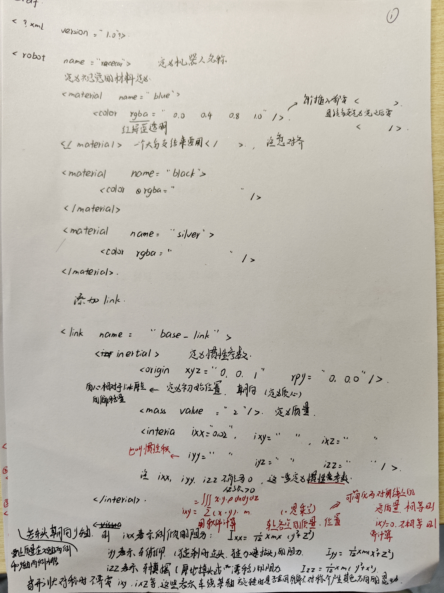
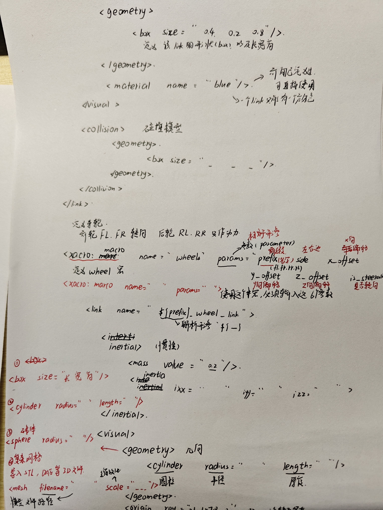
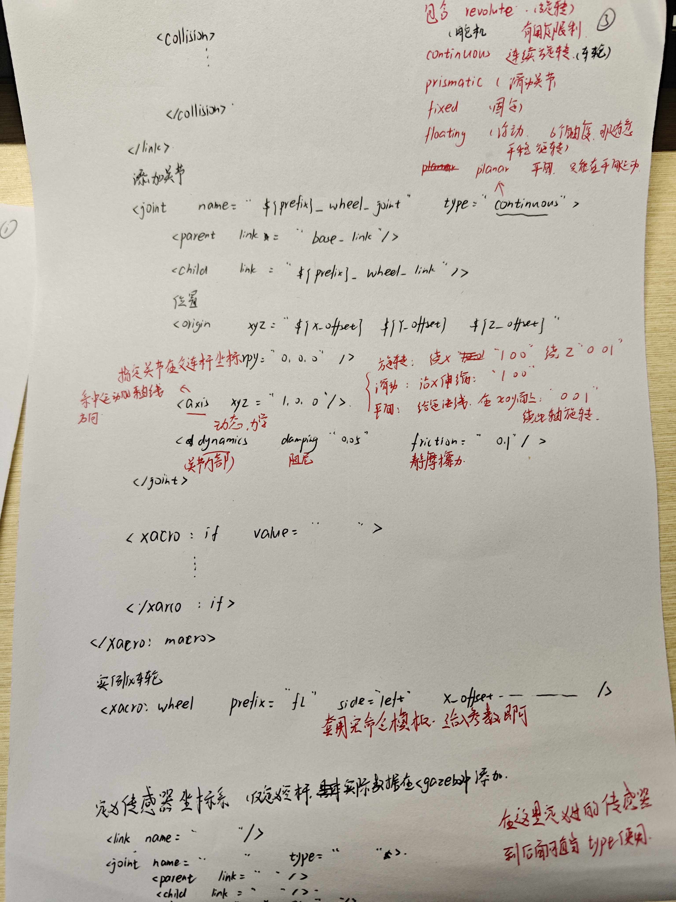

这次任务并没有完成。

仿真的确困难重重，一开始并没有找到好的教程，官网上的也看不懂，于是直接让deepseek生成了一份urdf的demo

选择用手抄的方式去理解每一步的含义和作用。（因为手写更方便我补充某些地方的定义，不是为了显得自己用功。。。）

之后懂了大致含义和作用，开始学网上的教程。但未能彻底理解。

而在终于编写完urdf文件后，运行又很困难，成功导入gazebo之后，又发现传感器无法发送数据（这也是这次任务未完成的部分）

本次任务仅完成了对urdf文件的编写，world的编写。能成功把模型导入gazebo中并且各个部件连接正确

在最后，由于始终无法让传感器发送数据，所以直接让ai对所有文件进行了修改，但仍无法解决。（当前显示的是自己写的，除了阿克曼的那部分）

总之，对ai的使用量还是很大的。

