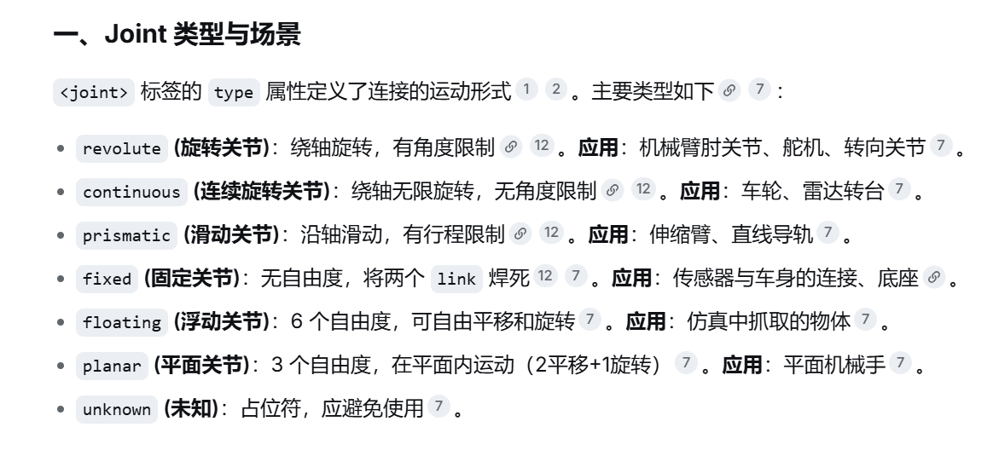

.

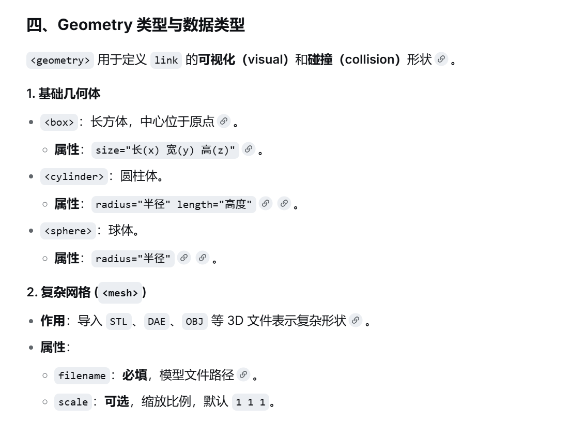
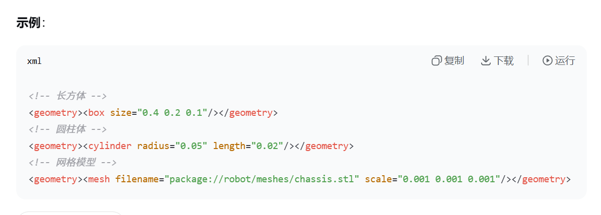

.

# 传感器：

一些传感器的定义库

https://gazebosim.org/libs/sensors/

  ### 对于每个传感器都要有以下代码：

  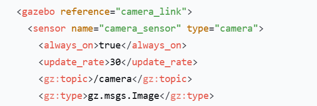
  ### always_on 表示一直开启，若为false,则会在订阅后才开启
  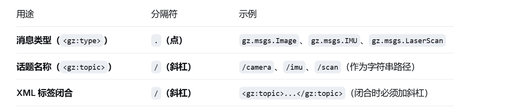

.

 ### 相机特有： 
   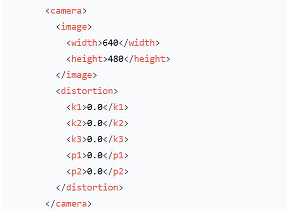
   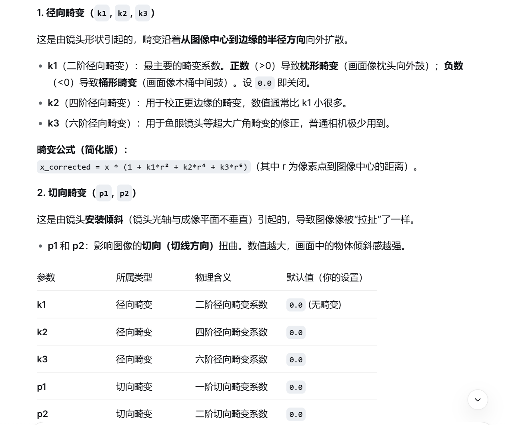

 ### 雷达特有：
 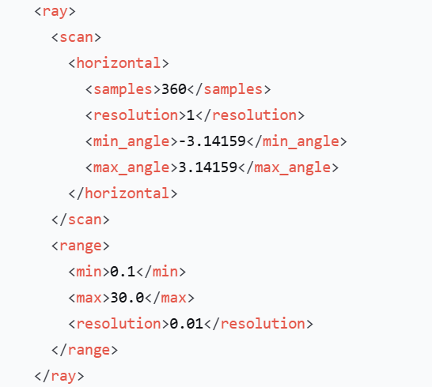

 ### <horizontal>是水平扫描

     <vertical>是垂直扫描

     <samples>是指雷达转一圈，一共发射并接受多少条激光束，数越大，分辨率越高，计算压力越大

     <resolution>是在这个水平层上，垂直方向有几个子采样层，一般为1

     <min_range>和<max_range>是扫描范围的最小和最大范围，单位为弧度，用-3.14159和3.14159，就能扫描360度

 ### <range>是扫描范围

     <min>是指最近检测距离，低于这个值，扫描不到

     <max>是指最远检测距离，高于这个值，扫描不到
     <resolution>是距离分辨率，定义扫描精度，单位为米，比如输入为0.01，则如果实际数据为2.022，则会输出2.02

# gps ,imu 磁力计（他们不需要特定子标签）（也可几何定义）

  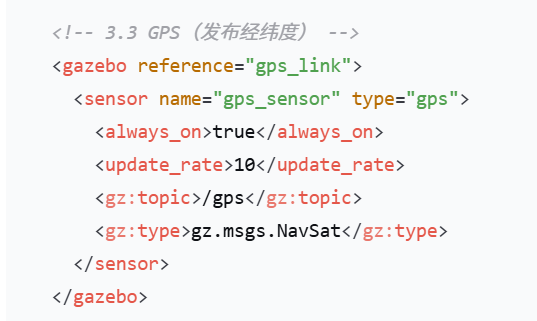

  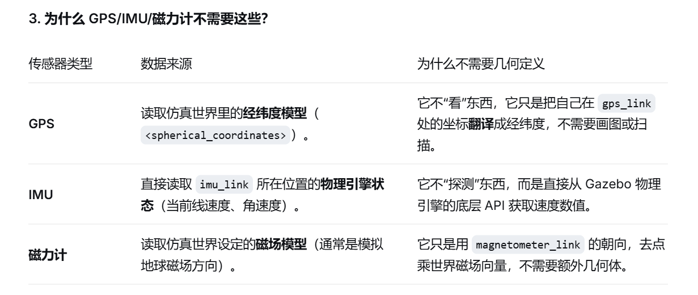

.

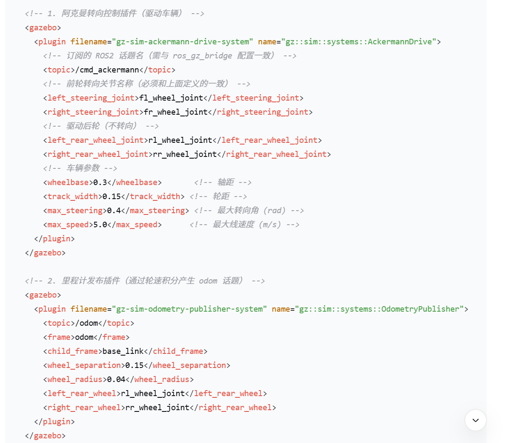

