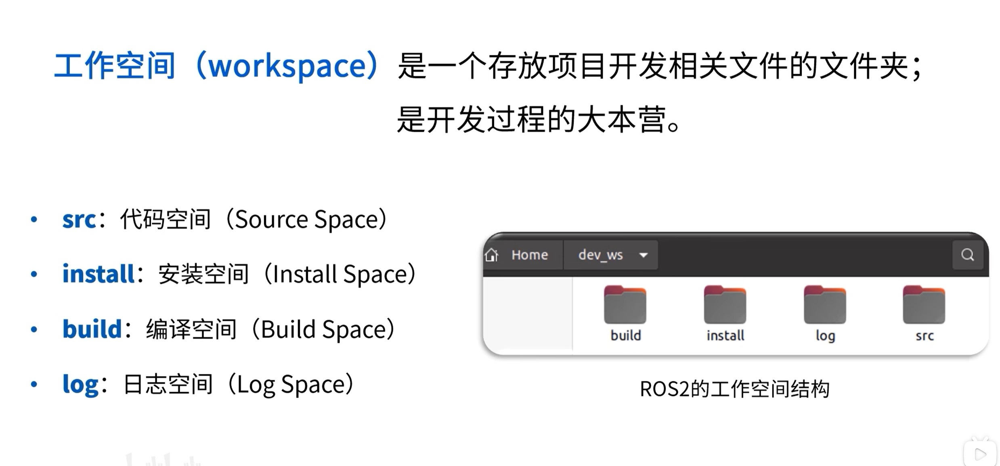
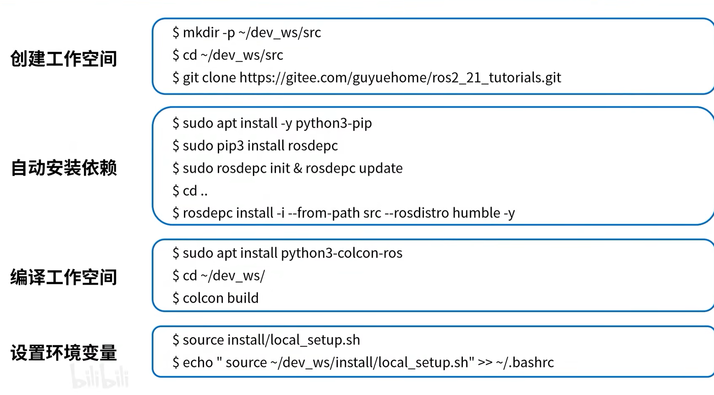

在ROS 2中，节点是构成计算图的基本单元，每个节点通常负责一个单一的功能

节点之间通过话题（Topic）、服务（Service）、动作（Action）或参数（Parameter）进行通信，共同完成数据的传输和处理

# 节点命令

 ros2 run 功能包名 可执行文件名：启动对应节点（注意进入对应的工作空间并刷新环境）

 ros2 node list:列出所有启动的节点

 ros2 node info 节点名: 获取节点的详细信息（比如话题，服务， 动作等）

 ros2 param list：显示当前所有的参数

 ros2 param get 节点名 参数名：显示这个参数的值

 ros2 param set 节点名 参数名 具体值：在节点运行时设置某个参数的值

 ros2 param dump 节点名：用于将特定节点的所有参数以 YAML 文件格式 导出

 ros2 param load  节点名  yaml文件名：使用 YAML 文件重新加载节点的参数

 （ros2 run 功能包名 节点名 --ros-args --params-file <file_name>.yaml 可以在启动节点的同时加载参数）

 ros2 topic list:显示正在活跃的话题

 ros2 topic info 话题名:显示对应话题的基本信息（包括发布节点和订阅节点数量和话题类型、如果要看节点名和QoS信息等详细信息的话需要加一个-v）

 ros2 topic echo 话题名:显示对应话题的实时数据

 ros2 interface show 消息类型：显示消息的格式

# 参数命令
 ros2 param list：显示当前所有的参数

 ros2 param get 节点名 参数名：显示这个参数的值

 ros2 param set 节点名 参数名 具体值：在节点运行时设置某个参数的值

 ros2 param dump 节点名：用于将特定节点的所有参数以 YAML 文件格式 导出

 ros2 param load  节点名  yaml文件名：使用 YAML 文件重新加载节点的参数

 （ros2 run 功能包名 节点名 --ros-args --params-file <file_name>.yaml 可以在启动节点的同时加载参数）

.

### YAML文件的后缀名为.yaml，一般储存在功能包目录下的config文件夹中

# Ros2工作流程：
 创建工作空间；

 创建功能包；

 编辑源文件；

 编辑配置文件；

 编译；

 执行

 mkdir -p ros2/ros2_case/src #创建工作空间以及子级目录 src，工作空间名称可以自定义（注意，这里的工作空间是ros2_case，而ros2只是一个普通的文件夹）

 cd ros2_case#进入工作空间

 colcon build #编译 

 

### 终端下，进入工作空间的src目录，使用如下指令创建一个功能包（以C++版本为例）：

 ros2 pkg create --build-type ament_cmake （ --dependencies xxx）--node-name my_node my_package
 

### Ros2发布端编辑源文件：
 ### 步骤：
    1.包含头文件；
    2.初始化 ROS2 客户端；
    3.定义节点类；
      3-1.创建发布方；
      3-2.创建定时器；
      3-3.组织消息并发布。
    4.调用spin函数，并传入节点对象指针；
    5.释放资源。
### 订阅端编辑源文件：
 ### 步骤：
        1.包含头文件；
        2.初始化 ROS2 客户端；
        3.定义节点类；
            3-1.创建订阅方；
            3-2.处理订阅到的消息。
        4.调用spin函数，并传入节点对象指针；
        5.释放资源。
### Ros2编译并运行功能包：
     进入工作空间
     colcon build ：编译工作空间内的所有功能包
     （若要指定编译的功能包则是colcon build –packages-select 功能包名）
     编译完成后，ros2 run 功能包名 可执行文件名     

### Ros2参数列表的增删改查：
     新增参数：this->declare_parameter(“键”,默认值)；
     （当然，这里的默认值也可以是变量）
     查询参数：rclcpp::Parameter car_type = this->get_parameter(“键");
     修改参数：this->set_parameter(rclcpp::Parameter(“键”,修改后的值));
     删除参数：this->undeclare_parameter(“键");

# Launch模块：
     作用：launch模块用于实现节点的批量启动，launch 文件可以使用Python、XML或YAML编写，不同格式的 launch 文件基本使用流程一致
 ### 基本操作：
     基本格式：
     from launch import LaunchDescription

     def generate_launch_description():
     #各种各样的操作内容
     return LaunchDescription([
        # 在这里放各种 launch action
     ])
 ### 常见的导入列表：
     from launch import LaunchDescription
     from launch.actions import DeclareLaunchArgument, ExecuteProcess
     from launch.conditions import IfCondition, UnlessCondition
     from launch.substitutions import LaunchConfiguration, Command, PathJoinSubstitution
     from launch_ros.actions import Node
     from launch_ros.substitutions import FindPackageShare
     from launch_ros.parameter_descriptions import ParameterValue
### 节点启动：
    xxx_node（要传回LaunchDescription 的节点名）=Node(
    package='turtlesim',
    executable='turtlesim_node',
    name='turtlesim',
    namespace='',
    output='screen’,
    #其他字段按需写入
    )
 ### 常见字段
- `package`：节点所在包名。
-  `executable`：可执行文件名。
- `name`：节点名。
- `namespace`：命名空间。
- `output`：输出方式，常用 `screen`。
- `emulate_tty`：是否模拟终端，常用于需要键盘输入的程序。
- `parameters`：传入参数，支持字典、YAML 文件路径、LaunchConfiguration 等。
- `remappings`：话题或服务重映射。
- `arguments`：给可执行程序传命令行参数。
- `condition`：条件执行。
- `respawn`：节点退出后是否自动重启。
读取参数：

### 声明参数：

    DeclareLaunchArgument(
     'use_sim_time',
     default_value='false',
     description=‘是否使用仿真时间’,  #在播放ros2 bag的时候的常见选项
    )
### 读取参数：
    use_sim_time = LaunchConfiguration('use_sim_time’)
### 传入节点：
    Node(
     package='demo_nodes_cpp',
     executable='talker',
     parameters=[
         {'use_sim_time': use_sim_time},
     ],
    #其他字段待补充
    )
### 读取配置文件（YAML参数文件）：
    param_file = PathJoinSubstitution(
     [FindPackageShare('param_case_package'), 'config', 'param_case.yaml']
    )

    Node(
     package='param_case_package',
     executable='param_case',
     name='param_case',
     output='screen',
     parameters=[param_file],
    )
### 启动节点：
    ros2 launch 功能包名 launch文件名

 # 常用命令：
•	ros2 bag play 包的路径：回放数据包中的 topic

•	ros2 bag play -r 2 包的路径：如果想改变消息的发布速率，
可以用上面的命令，-r 后面的数字对应播放速率

•	ros2 bag play –l 包的路径：如果希望循环播放，可以用该命令

•	ros2 bag play 包的路径 --topic /topic1 /topic2 ……：只播放感兴趣的 topic 

•	ros2 bag record –a：将当前发布的所有 topic 数据都录制保
存到一个 rosbag 文件中，录制的数据包名字为日期加时间

•	ros2 bag record /topic_name1 /topic_name2 /topic_name3：只记录某些感兴趣的 topic

•	ros2 bag record -o 新的路径  /topic_name1：如果要指定生成数据包的名字和路径，则用-O /-o 参数

•	ros2 bag info 包的路径：显示数据包中的信息

 

# Rviz2：

RViz 是 ROS Visualization Tool 的首字母缩写，直译为ROS的三维可视化工具

### Rviz发布marker：
 包含头文件: 引入 ROS 2 节点、定时器、以及 visualization_msgs::msg::Marker 类型。

创建节点类 MarkerPublisher: 封装 publisher 与定时器逻辑创建 publisher: create_publisher<Marker>("visualization_marker", 10) —— 在 ROS 网络上声明并发布 Marker 消息的通道。

创建定时器: 周期性触发 publish_marker()，用于持续更新或重复发布 marker。

# 构造 Marker 消息:
header.frame_id 与 header.stamp：指定 marker 所在坐标系与时间戳，rviz 用以把 marker 放置到正确位置。

ns 和 id：用于区分不同的 marker（同一 ns+id 会被更新而不是叠加）。

type：选择可视化形状（球/方/箭头/文字等）。

action：ADD 添加或更新，DELETE 删除。

pose：位置与朝向，决定 marker 在坐标系中的姿态。

scale：控制大小，必须非零。

color（含 alpha）：定义可见颜色与透明度，alpha=0 将不可见。

lifetime：非零时 marker 会在过期后自动消失，0 表示一直存在。

发布消息: marker_pub_->publish(m) 将消息发到 ROS 网络，rviz 订阅后显示。

main() 初始化/自旋/关闭：标准 ROS2 程序生命周期管理。

