# 常见命令：

 在.bashrc中添加命令：有些命令，比如ros2，每次打开都需要输入一些别的东西，为了方便，可以在.bashrc中添加这个命令，之后再打开终端，就可以直接输入ros2了。（具体命令是 source 地址）(~表示根目录home)

 pwd：显示当前工作目录（显示现在工作的位置，比如D:/Users/ASUS/Desktop/ros2学习笔记2.md）

 ls：显示当前目录下的文件和目录
 
 ls-A：显示当前目录下的所有文件和目录（包括隐藏文件,隐藏文件以.开头）
 
 mkdir  文件夹名 :创建文件夹
 
 touch  文件名.扩展名 :创建文件
 
 cd  目录名: 切换目录
 
 rm  文件名.扩展名 :删除文件
 
 rm -R  文件夹名 :删除文件夹，包括文件夹中的所有文件和子文件夹

 Ctrl+C :停止当前命令
 
 sudo apt install 应用名 :安装软件  (其中sudo是提取权限)

 ### ros2 node:对节点操作
 
 ### ros2 topic:对话题操作

 ros2运行功能包节点的命令
 
 ros2 run turtlesim turtlesim_node :这一步是ros2运行了turtlesim功能包中的turtlesim_node节点，运行后可以开始海龟的仿真
 
 ros2 run turtlesim turtlesim_teleop_key :这一步是ros2运行了turtlesim功能包中的turtlesim_teleop_key节点，运行后可以开始键盘控制海龟的
 
 移动(需要另开一个终端)
 
 ros2 node :可以查看当前运行节点的所有信息，但其实到这里还没结束，系统会推荐后续用info 还是list命令等
 
 ros2 node list :可以查看当前运行节点都有什么内容，也就是有什么节点
 
 ros2 node info /节点名 :可以查看当前运行节点的所有信息，包括节点名、命名空间、参数等
 
 ros2 topic :可以查看当前运行的仿真器的所有数据
 
 ros2 topic echo /话题名 :可以查看当前运行的仿真器内每一帧的数据，包括X Y Z坐标，线速度，角速度（以海龟中的为例）
 
 ros2 topic pub /话题名 话题类型 消息内容 :可以发布消息到指定的话题

 rqt_graph :可以查看当前运行的所有节点和话题，以及它们之间的关系(与前面不同的是，它直接打开了一个新窗口去描述不同节点之间的关系)
 
  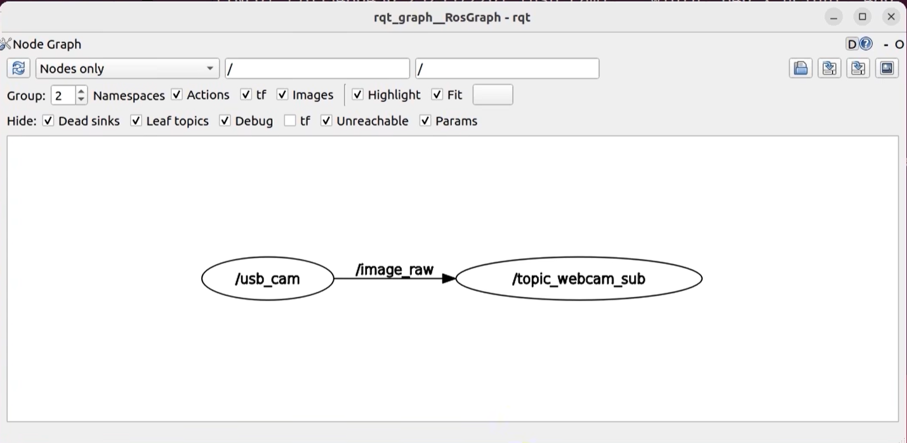

 
 
 其中，rate 1指的是频率为1Hz（1秒发布1条命令），命令针对turtlesim1节点的 /cmd_vel（速度控制接口）话题

 后面的是“话题的消息”以及数据格式（分别定义了线速度和角速度在每个方向的分量）
 
 比如上图中，发布一个消息到/cmd_vel话题，消息类型为geometry_msgs/msg/Twist，消息内容为{linear:{x: 0.5, y: 0.0, z: 0.0}, angular:{x: 
 
 0.0, y: 0.0, z: 4.5}}，这样就可以让海龟自己动起来

 

 service表示调用服务，调用的是spawn服务，生成一个新的海龟，后面是服务的参数（也就是新生成的海龟的参数）（其中名称会默认以turtle1和turtle2等命名）

 ros2 bag record /话题名 :可以记录当前运行的仿真器的所有数据，并把他们保存在当前目录下（比如record /turtle1/cmd_vel）

 ros2 bag play 文件名/（这个文件就是上面录的数据的文件） :可以回放记录的数据,复现数据

·

·

·

# 工作空间的了解：

代码编写和编译都是在src中，编译过程产生的文件都在build目录下，编译完成后所有可执行文件和脚本都被放在install目录下，编译信息以及报错之类的都被放在log目录下，便于回看

创建工作空间的第三行是下载文件，格式是 git clone 地址，也可以直接把文件手动剪切到src目录下，这是配置过程，可删

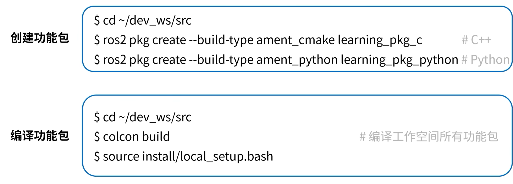
ros中创建功能包：
 ros2 pkg create --build-type <ament_cmake/ament_python>(这里是指定功能包类型是c++，还是python等) 功能包名
 有CMakeLists.txt或者setup.py文件（设置编译规则）和package.xml（描述功能包的基本信息，如版本、依赖（运行这个功能包所必须的其他功能包，若无，则需安装）等）文件的目录才是功能包目录。（c++有CMakeLists.txt文件，python有setup.py文件）

.

.

.

# 节点

 具体操作步骤：

   colcon build  ###先编译

   ros2 run 功能包名 节点名 ### 运行节点 (需先编译，因为run的是install里的文件)

### 一个完整的代码演示：
 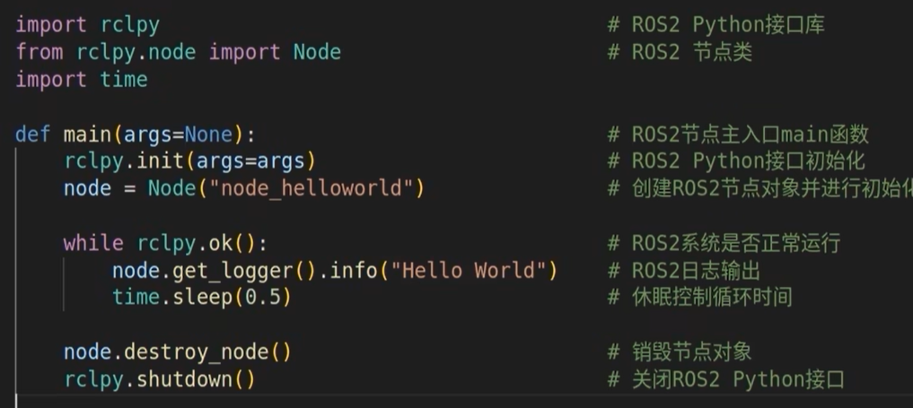

 其中，time是时间戳，用于记录消息的发送时间，当有些循环发送信息的依据是时间时，就可以用time来实现。（比如每1秒发送一次消息）

 note = Node（“节点名”）：节点名是节点的唯一标识符，用于在ros2中识别和管理节点。（这一行以上都是在设置节点）

 Node是ros2中的一个概念，用于在ros2中运行节点。（是ros2的python类或者说节点）

 while下的node.get_logger().info("hello world") 就相当于在ros2中打印hello world

 time.sleep(0.5) 就相当于每0.5秒打印一次hello world

 整个程序以Ctrl+C结束

 而针对python文件，还需要配置接口（为了使run命令能够找到这个节点），才能在ros2中运行。接口是在setup.py文件中配置的。具体配置如下图：

 [一般最后一个都是，main函数，因为所有程序都是从main函数开始的]

 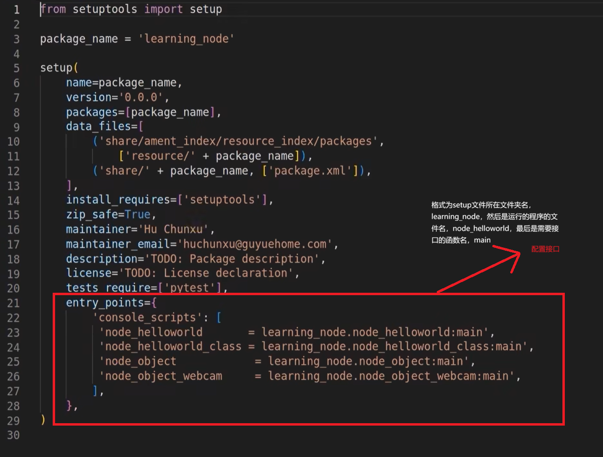
 
.

 自行构造类：(同样需要在setup.py文件中配置接口)（效果跟前面的完全相同，只是可读性更强）（面向对象的编程）
 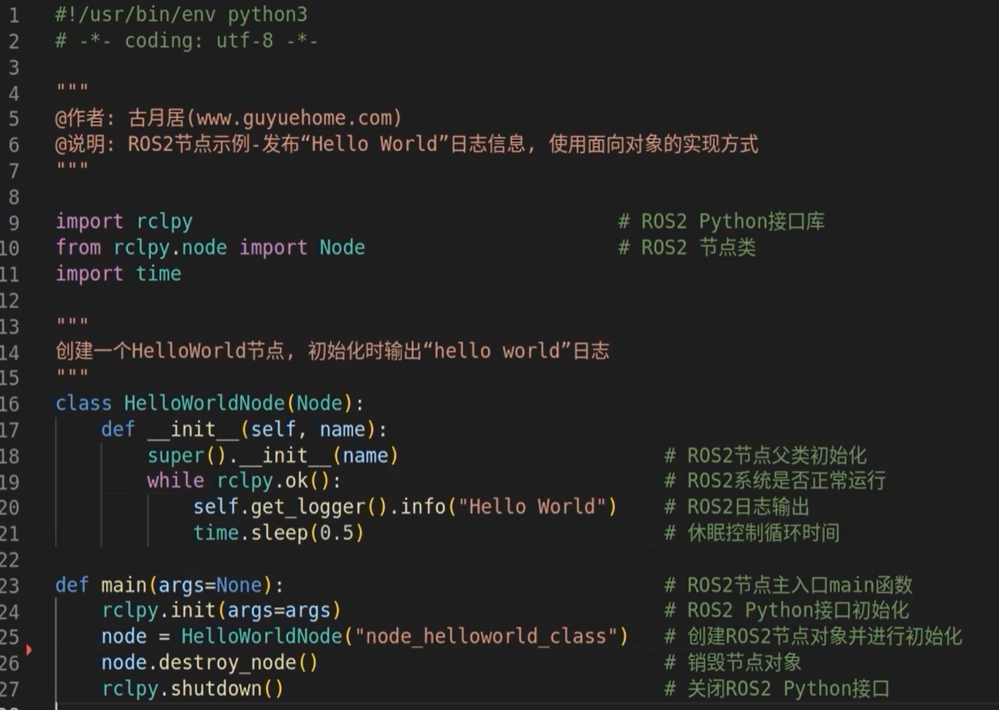

 编译好的文件一般在这样的目录里：
 

# 话题 用的是.msg文件
 被称为节点间传递数据的桥梁，不同节点之间传递的信息就是话题。因此可推知一个发布者可以产生多个话题。
 
 举个例子：一个公众号，有多个发布者，多个订阅者，而发布者的消息就是话题 （这个过程存在异步通信）

 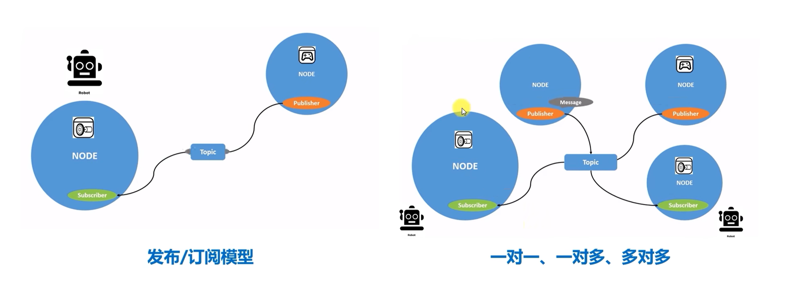
 注意，在这个多发布者的情况下需要规定优先级

 ### 话题常见命令：
       ros2 topic list :可以列出所有话题
       ros2 topic echo /话题名 :可以查看当前运行的仿真器内每一帧的数据，具体跟话题数据相关，可以是位置、速度、加速度，以及传输的信息大小，RGB值等数据
       ros2 topic info /话题名 :可以查看当前运行节点的所有信息，包括节点名、命名空间、参数等
       ros2 topic pub /话题名 话题类型 消息内容 :可以发布消息到指定的话题
       ros2 topic sub /话题名 话题类型 :可以订阅指定的话题
       ros2 topic history /话题名 :可以查看指定话题的历史消息
       ros2 topic delete /话题名 :可以删除指定的话题
       ros2 topic create /话题名 话题类型 :可以创建指定的话题
       ros2 topic bw /话题名 :可以查看指定话题的带宽信息(传输速度，消息大小)

.

 ### python的类中，
     def __init__(self, name):
        super().__init__(name)  
           类 = 一张“节点设计图”（比如：每个节点都应该有名字、定时器、发布功能）。
           self = 根据设计图造出来的具体那台机器（比如名为 topichelloworld_pub 的那个节点）。
          当你写 node = PublisherNode("topichelloworld_pub") 时，Python 会自动把新建的节点对象传给 self。
          这样做可以实现让self成为全局变量，相应的，不带self的变量就是局部变量，不能被其他函数访问。

.

### 具体代码样例（发布者）：

  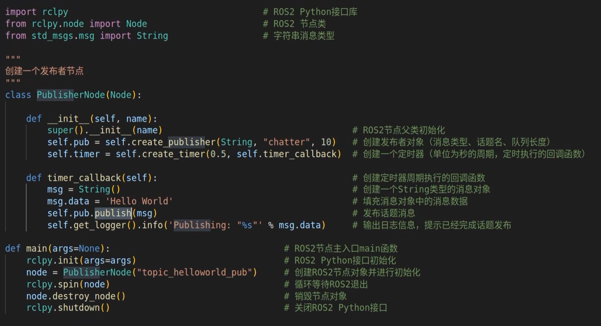
 
    先定义PubilsherNode类，然后初始化父对象，使这个对象有Node的格式。

    然后创建发布者对象 self.pub=self.create_publisher(消息类型如字符串等, "话题名", 队列长度) 
 
    【其中，队列长度可理解为缓冲区，当发布者发布信息但是没有订阅者接收时，就会把信息放到队列中，等有订阅者接收时，就会把信息从队列中取出来。最大缓冲信息数等于队列长度】

    self.timer=self.create_timer(时间间隔, self.timer_callback（回调函数）)  (定义多久发一回数据)（一般是必需的，是因为程序要持续运行）
 
    再下面就是这个对象要执行的操作，这个操作要写到__init__函数里。（比如图中time_callback就在self.timer 里重现了）

    首先定义函数，并把self作为参数，之后定义操作的数据，这里是“hello world”，最后发布这个函数

    .

    ### 发布函数的命令：
      self.pub.publish(要发布的数据)                           [这一步是发布数据]
      self.get_logger().info("Published: %s" % (要发布的数据)) [这一步就是打印发布的数据（可视化）]

    .

    ### 最后在main里的流程就是：
     先初始化python接口，然后创建节点并发布（创建的PublisherNode类会自动执行里面的所有内容）
     接着，循环等待退出（spin），然后结束程序
   流程：

  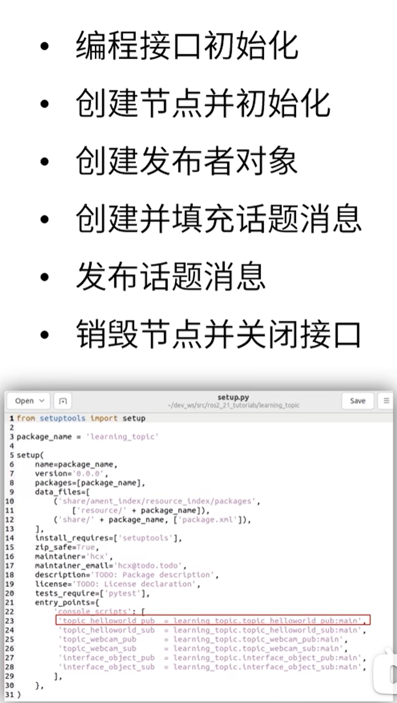
### 订阅者：

  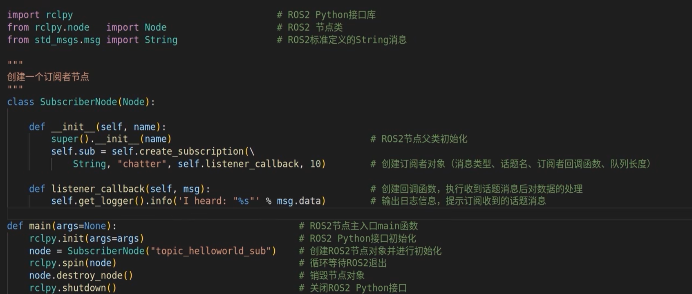
     
     可同上分析，只是把发布者的pub改成订阅者的sub，create_publisher改成create_subscription，publish改成callback函数（回调函数），以及一些细节上的调整（比如回调函数的参数等）

   流程：

  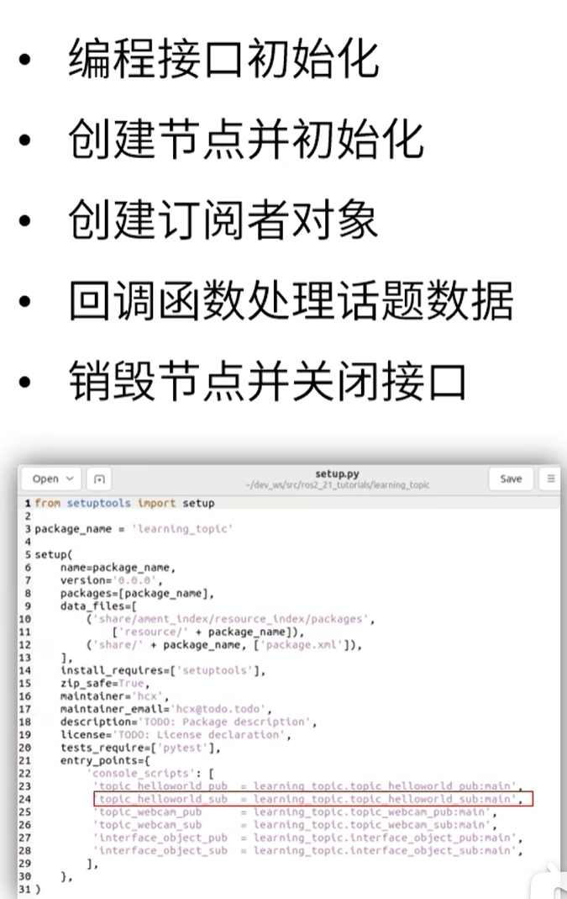

 ### 需要注意的是，不管是订阅者还是发布者，都需要在setup.py文件中配置接口，才能在ros2中运行。

.
 
.

.

# 服务：用的是.srv文件
  
  主要结构： 客户端/服务器（C/S）模型，是同步通信机制。服务器端唯一，客户端可以有多个。
  【这个过程有点像调用函数，传参，返回值】。

  作用：定义请求和应答的消息格式。

  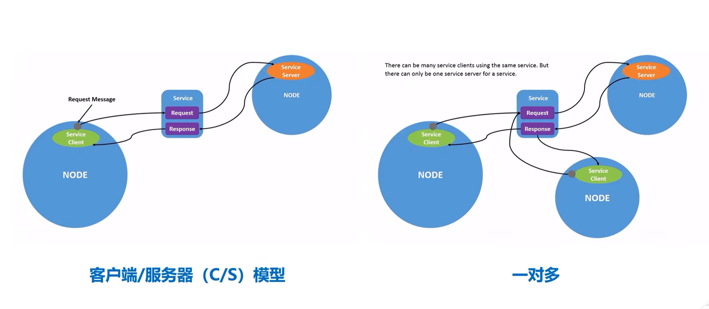

 ### 服务器端代码样例：

  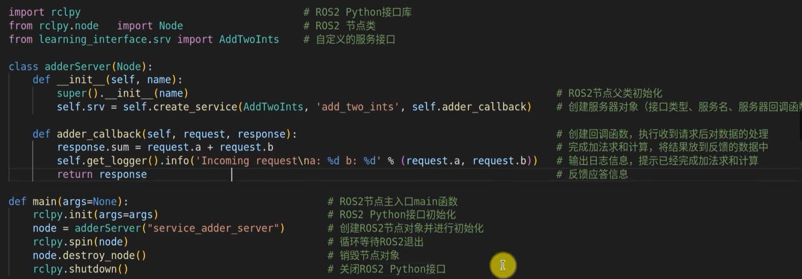

    其中，第一个def就是定义一下，跟上面的发布者和订阅者大致类似，只是改成了service。

    然后回调函数这一部分需要有三个参数，分别是self，request（请求，客户端发的信息），response（应答，服务器端产生的信息）。

 ### 客户端代码样例：
  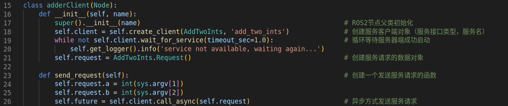
  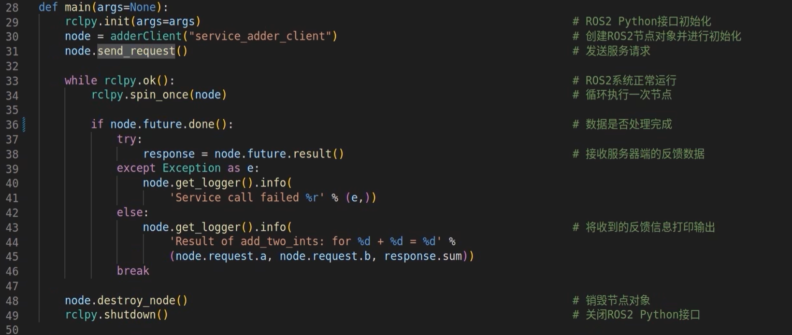
          def 及以下的两行都是定义

          而由于客户端不需要执行运算，所以也就没有回调函数

          然后 while 就是循环等待服务器端的应答，直到服务器端返回应答（看服务器是否启动）

          self.request =AddTwoInts.Request() 这一步是把接口中的数据赋给self.request，从而方便后续计算等
          
          下一个def 的作用使封装请求数据和服务器端的应答数据

          self.request.a = int(sys.argv[1]) 这一步使把在终端输入的第一个参数先转化为整型，再赋值给self.request.a

          用call_async 的作用是得到一个未来值（future对象），也就是说，在这一步不需要等待服务器回答，等到服务器回答了，它会自动赋值给self.future,从而可以判断服务器是否回答了，在后续的代码中，也会验证self.future来判断服务器是否工作了

          注意：这里的函数调用没有在定义里面，而是放在了main里面，之前直接放在定义里可能是因为需要回调函数，持续进行信息传递，但现在只需要一次，所以不用放在定义里面

          每次spin_once() 都会查询应答，看有没有返回值
          
          通过if判断future是否完成，然后再把future的结果赋出来。接着，通过except判断结果是否异常，如果异常，则打印第一条。如果正常，也就是except没有报错，打印第二条，即服务器端返回的应答  

.

.

.

# 通信接口：对消息结构的定义

 定义方式：
 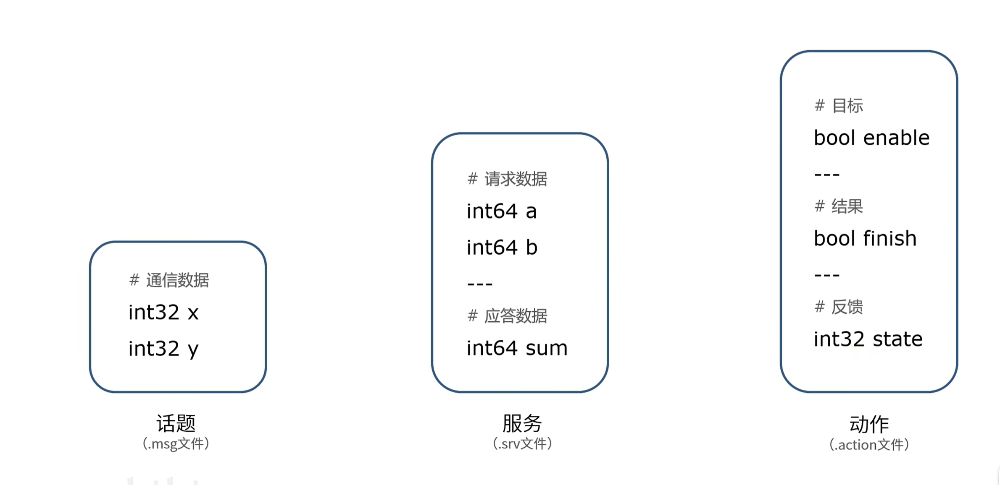
 [第一个是定义里一个二维的信息，第二个是两数相加，第三个是动作，负责执行一个任务]
 
 ### 官方定义可在.msg（对话题的结构）、.srv(对服务的结构)文件中查看。（从ros安装路径下的share目录中查看）

 ### 查看常用接口的指令：

  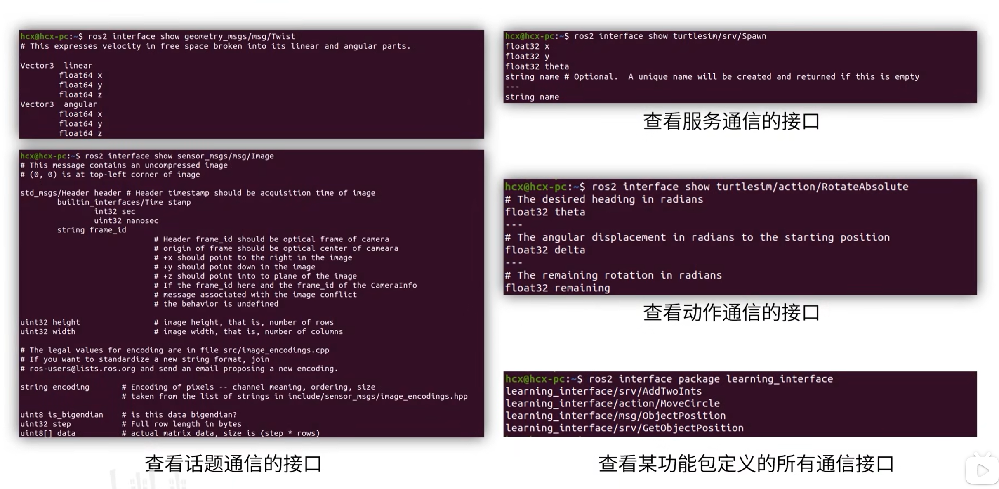

       如 ros2 interface 

        ros2 interface show 接口名(前面需要补充接口所在文件夹名，比如ros2_interfaces.msg) 这样就能查看接口的定义了
        ros2 interface package 功能包名 :  看某一个功能包定义了哪些内容(哪些接口)

.

.

# 动作：

### 完成一个动作的流程：

 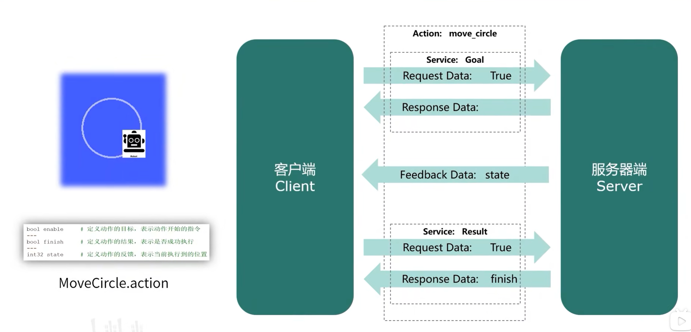

 1. 定义接口：（动作的接口是定义在一个.action文件里的，定义的格式如下）
   
   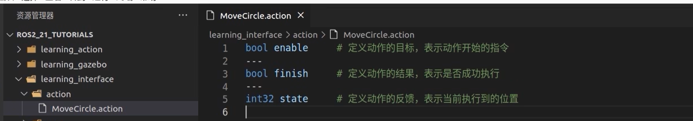

   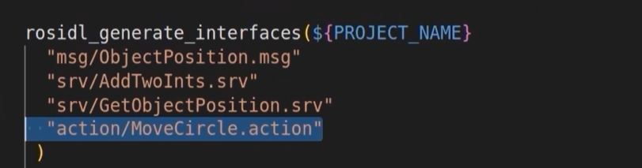

     [这个接口还需要在CMakeLists.txt文件中配置，才能在ros2中运行。]

  ### 动作服务器端代码样例：

  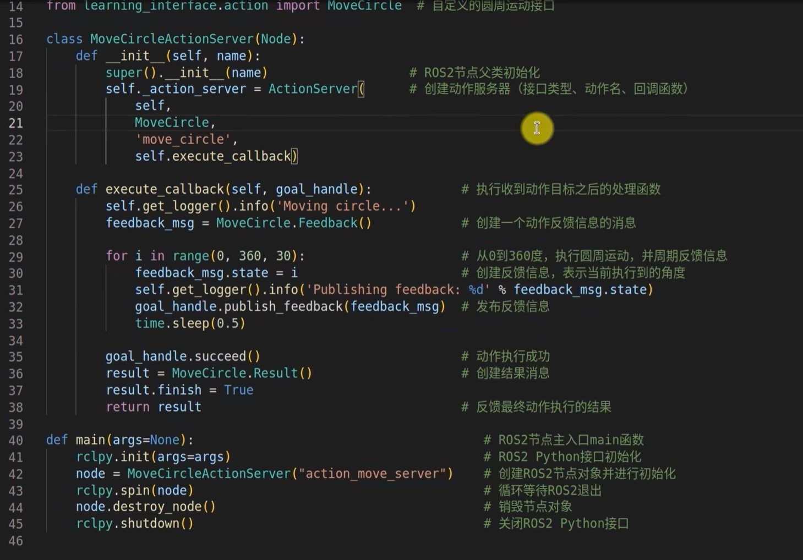
    
     from那一行就是调用接口，from+接口所在文件夹名+ import+接口名
     self._action_server = ActionServer(
        self
        接口类型（就是刚才插入的接口）,
        '接口名',
        回调函数
     )
     回调函数： 1.先打印要开始执行动作
                2.创建一个变量来存储反馈值
                3.利用循环打印值（注意，这里的循环是假的，它仅仅是为了演示）
                4.返回结果（是否结束）

### 动作客户端代码样例：
 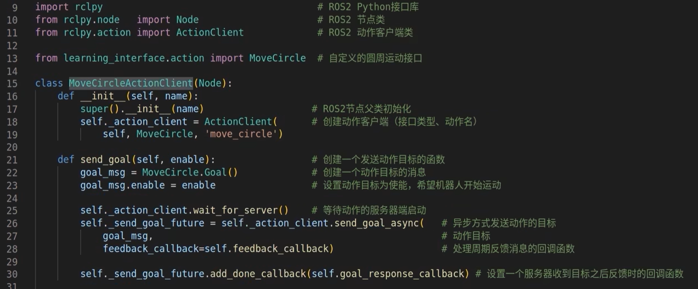
 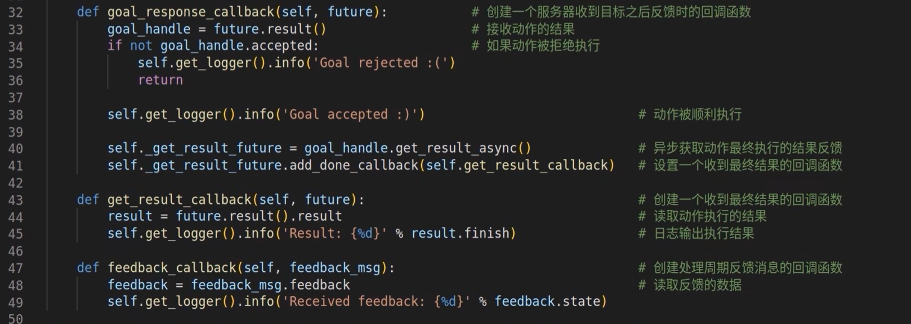
 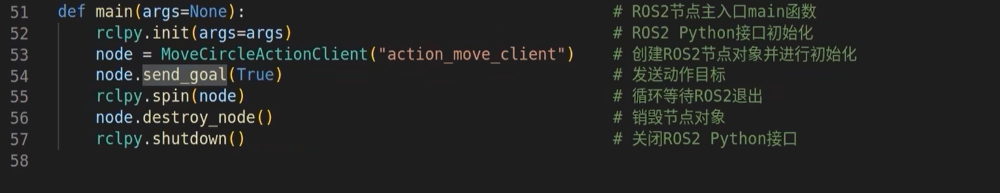
   
   ### send_goal的作用是发送动作给服务器端
            先对Goal实例化（也就是把动作所有的参数都赋值给goal_msg），然后对goal_msg.enable（这个用来设置是否开启动作）赋值，这个后面的enable是函数的参数，是在main里面赋的

            下一行是发送动作给服务器端，返回一个future对象（也就是实时反映数据）

            self._send_goal_future.add_done_callback(self.goal_response_callback) 这那一行的回调函数作用是告诉你你发送的指令服务器端已经收到了 所以是一个goal_response_callback函数

            再往下是goal_response_callback函数的定义
  ### 也就是说，以上的三个回调函数，第一个是反映是否发送成功以及是否开始执行，第二个是是否执行成功，第三个则是反映中间过程

  .

  .

  .

# launch文件:实现多节点的同时运行

 操作命令： ros2 launch 功能包名 launch文件名 ： 运行launch文件

 ### 代码样例（对节点）：

 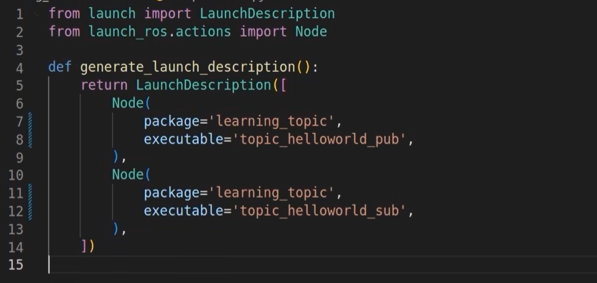

    第一行插入是提供一个launch文件生成的方式（具体实现会根据下面的描述展开）

    第二行插入是引入节点的说明

    package=功能包
    
    executable=可执行文件名

    Node 表示节点
  .
  
  .

  .
  ### 代码样例（对话题，重命名、添加关联）：
  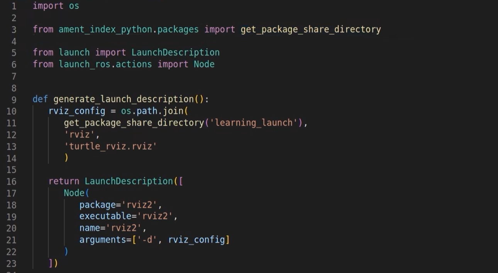
  
  .

  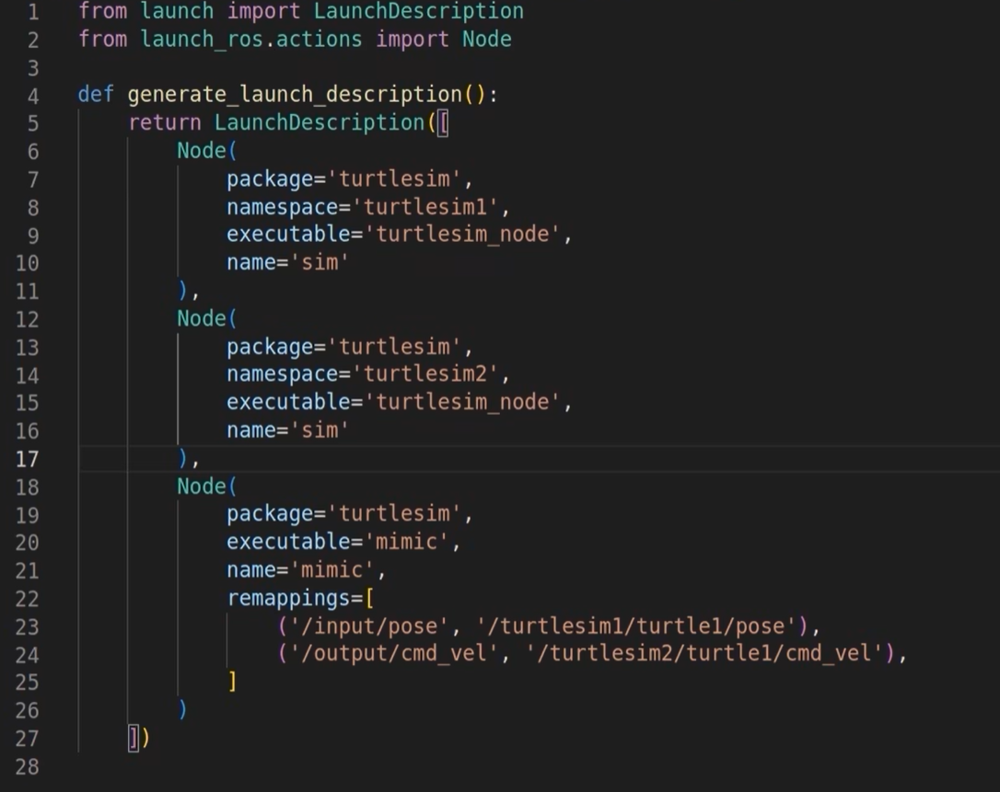

     其余同上，最后添加arguments，给launch添加launch文件的参数，使这个launch能运行特定的节点
     [比如这个launch是用来启动rviz2的，添加了arguments，使rviz2能直接运行相应的文件，而不只是空文件]
     arguments=['-d', 文件路径]
     【路径通过 os.path.join((文件夹)，子文件夹，文件名)函数来获取，返回的是一个表示路径的字符串】
     注意：launch中的命名可以跟原文件不一样，并且修改之后会直接覆盖原文件名（防止多个同名文件一起运行会报错）
     
     特别的：
            name是节点运行的名称，不能跟原文件名一样，是运行时别名
            namespace是节点的命名空间，也就是文件所在的文件夹路径，是分组前缀
            executable是节点的可执行文件名，是节点的入口，它必须等于真实文件名
    
    第二张图片的最后一个Node ，它设置了一个mimic，作用是：
                 当你只对一只乌龟进行操作，它会产生位置信息，然后这个位置信息会变成速度信息发布出去，然后被另一个乌龟接收，所以两只乌龟会一起移动
    而代码中的操作意思是 原本名为/input/pose的话题，现在改为/turtlesim1/turtlel/pose
    然后输出的话题，原本是/output/cmd_vel，现在改为/turtlesim2/turtlel/cmd_vel  
    只有这样改完之后才能匹配上，否则会报错（因为上面的Node已经更改了话题名）

 .

 .

 .

 ### 代码样例（对参数）：

   第一种：直接在launch文件中添加参数，上面的代码是给这些参数赋值，下面的具体解释是：提取后面的参数的值，赋给前面的参数并输出（传到ros2中）（这种修改发生在launch文件里）

 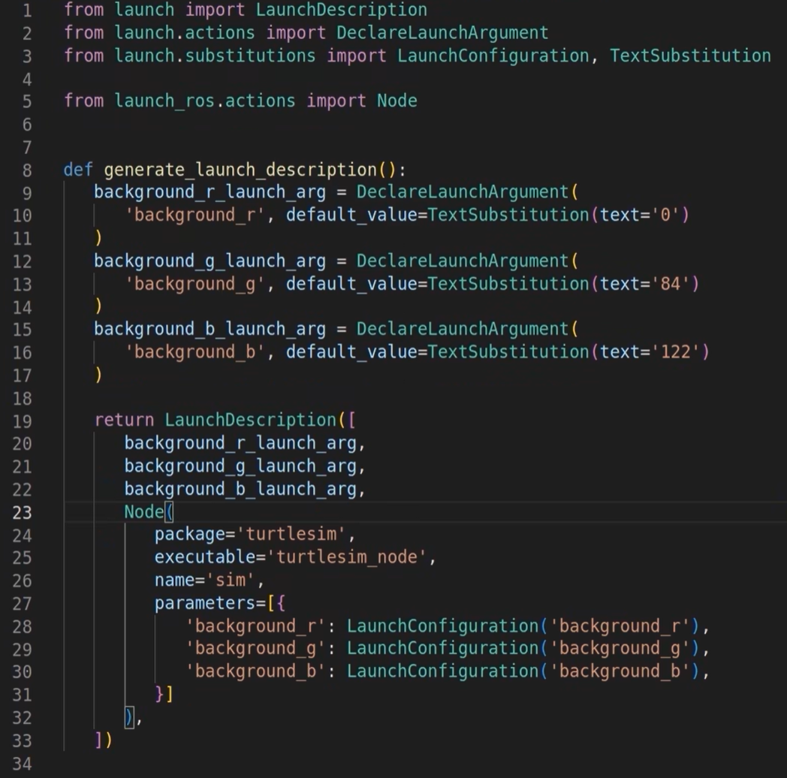

  第二种，直接修改原参数文件（yaml文件）（这种修改发生在yaml文件里）

 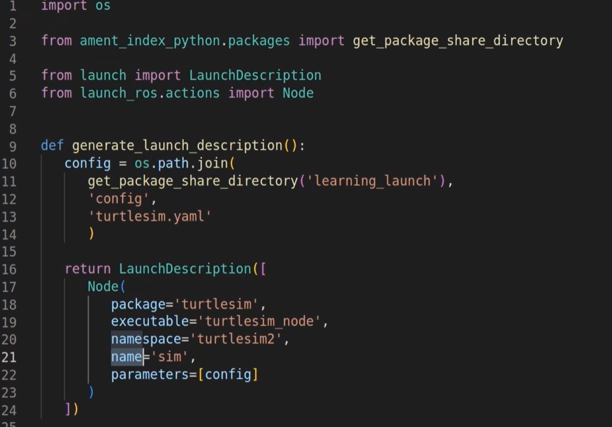

 ### 插入yaml文件的格式：

 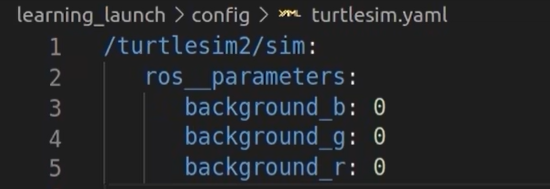

 注意：yaml文件中的路径跟launch文件中的路径一致。

### 通过一个launch文件同时启动多个launch文件

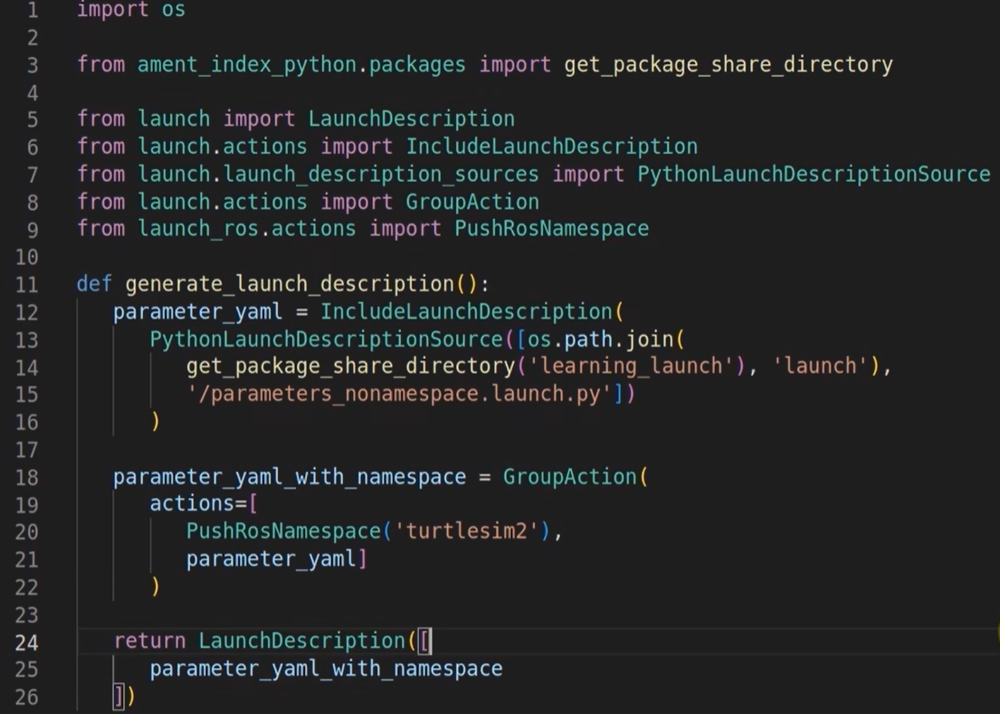

.

.

.

# rviz2